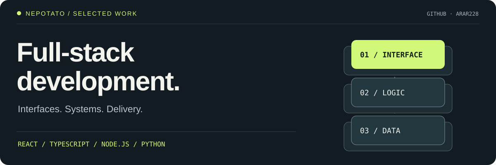

  <a href="README.ru.md">Русский</a> ·
  <a href="PROJECTS.md">Project index</a> ·
  <a href="docs/portfolio.en.md">Detailed case studies</a> ·
  <a href="https://github.com/arar228?tab=repositories">Repositories</a> ·
  <a href="https://x.com/ton_potato">X / @ton_potato</a>

## Hi, I'm nepotato

I build web products, Telegram Mini Apps and the infrastructure behind them.
My work connects **interfaces, backend systems and delivery**: from React and
TypeScript to Python automation, data pipelines and Linux services.

I use AI-assisted development to move from a product idea to code, tests and
deployment. The repositories below show the engineering decisions, working
examples and verification scope of each project.

  
  
  
  
  
  

## Selected work

| Project | Engineering focus | Explore |
| :--- | :--- | :--- |
| **[Memora Solutions](https://github.com/arar228/memora-solutions)** | Web/desktop productivity tools, shared UI, payment-event handling and release recovery | [Product](https://memorasolutions.ru) · [Architecture](https://github.com/arar228/memora-solutions/blob/master/docs/architecture.md) |
| **[VPN Bridge](https://github.com/arar228/vpn-bridge-showcase)** | Two-node encrypted transport, Hysteria2/REALITY, configuration generation and alert state transitions | [Security model](https://github.com/arar228/vpn-bridge-showcase/blob/main/docs/security.md) · [Case study](https://github.com/arar228/vpn-bridge-showcase/blob/main/docs/case-study.md) |
| **[RuMarket](https://github.com/arar228/rumarket-showcase)** | Economic-data collection, freshness/quality checks and source-aware analytical presentation | [Product](https://statik.obdrisher.ru/) · [Architecture](https://github.com/arar228/rumarket-showcase/blob/main/docs/architecture.md) |
| **[Night Arcade](https://github.com/arar228/potato)** | Telegram Mini App, typed API contracts, virtual-point ledger and server-owned game rules | [Engineering case](https://github.com/arar228/potato/blob/main/docs/CASE_STUDY.md) |
| **[Procedural GPU](https://github.com/arar228/nepotato-threejs-gpu)** | Editable Three.js geometry, reusable model API and browser rendering | [Interactive demo](https://arar228.github.io/nepotato-threejs-gpu/) |
| **[TON Subscriptions Protocol](https://github.com/arar228/ton-subscriptions-protocol)** | Recurring-payment channel research, asynchronous state transitions and sandbox tests | [Contracts and tests](https://github.com/arar228/ton-subscriptions-protocol) |

Memora and RuMarket have product links; the repositories describe their deployment
and review scope. VPN Bridge is a sanitized public showcase of a privately operated
system. Night Arcade is a play-money prototype. TON Subscriptions is contract
research; real-funds use requires an independent security audit.

## Selected research & publications

I publish source-code reviews and TON on-chain analysis as
[@ton_potato](https://x.com/ton_potato). Selected work:

| Publication | Research contribution | Source |
| :--- | :--- | :--- |
| My Wallet · NFT validation | Compared upstream code revisions and documented local tests of NFT ownership checks before signing | [Read the analysis](https://x.com/ton_potato/status/2107014919971361084) |
| Telegram Desktop · web-login links | Reviewed an upstream security change and explained login-token cleanup and the distinction between source changes and released builds | [Read the analysis](https://x.com/ton_potato/status/2106795206397788169) |
| TON · USDT supply | Reconciled token-contract and treasury data with the issuer's transparency report; separated circulating supply from issuer inventory | [Read the analysis](https://x.com/ton_potato/status/2106409334619955430) |

These are independently published analyses. The software fixes discussed in the
posts were implemented by their respective upstream maintainers.

## How I approach a system

**Product → contracts → implementation → verification → delivery.**

- Make state ownership explicit: API contracts, access control and storage boundaries.
- Design recovery paths: retries, idempotent events, health checks and deployment rollback.
- Keep projects reviewable: setup instructions, architecture notes and reproducible checks.
- Describe security through trust boundaries and actual protocols.

## Beyond the main projects

The [public project index](PROJECTS.md) includes frontend experiments,
Telegram tools, Python exercises and ecosystem work. The
[detailed portfolio](docs/portfolio.en.md) explains the original cases in depth.

